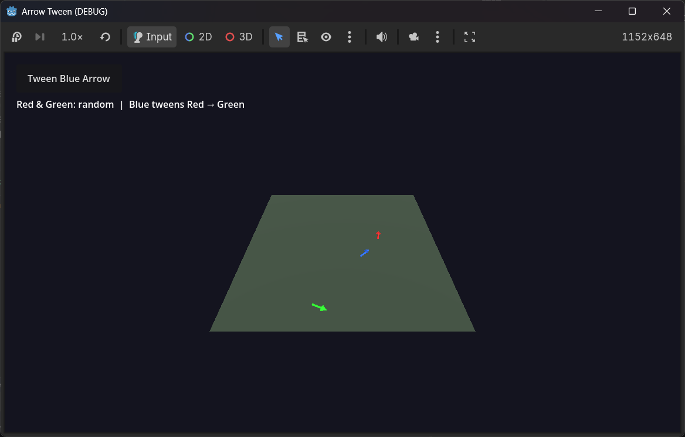
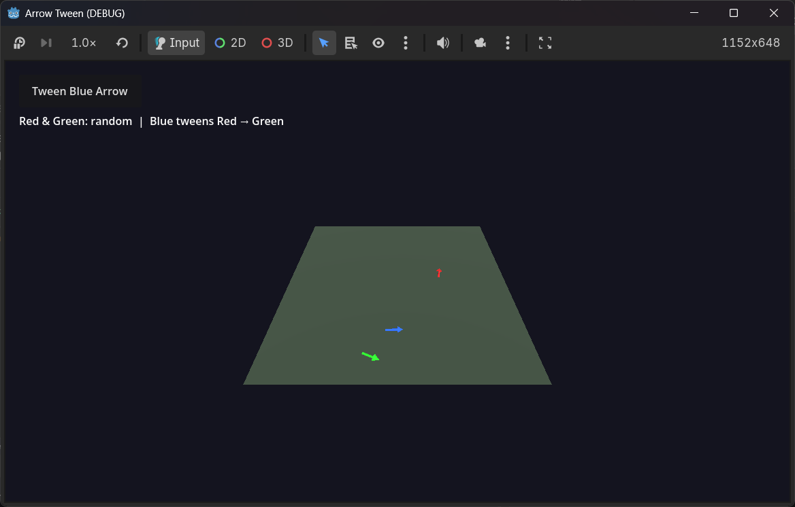

# Simple Tween Example

A blue Arrow will tween from the Red Arrow to the Green Arrow when you press "Tween Blue Arrow" button.

Red/Green are both randomly positioned/angled when you start the project.

The only bit of interesting code is this:
```
func _on_tween_button_pressed() -> void:
	if active_tween != null:
		active_tween.kill()

	# Snap blue to red, then tween to green
	blue_arrow.position = red_arrow.position
	blue_arrow.rotation.y = red_arrow.rotation.y

	active_tween = create_tween().set_parallel(true)
	active_tween.tween_property(blue_arrow, "position", green_arrow.position, 5.0)
	active_tween.tween_property(blue_arrow, "rotation:y", green_arrow.rotation.y, 5.0)
```

Here's sample screenshots





